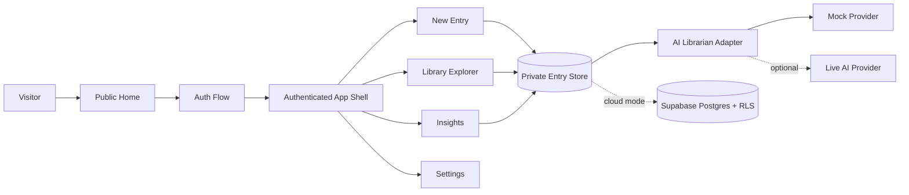
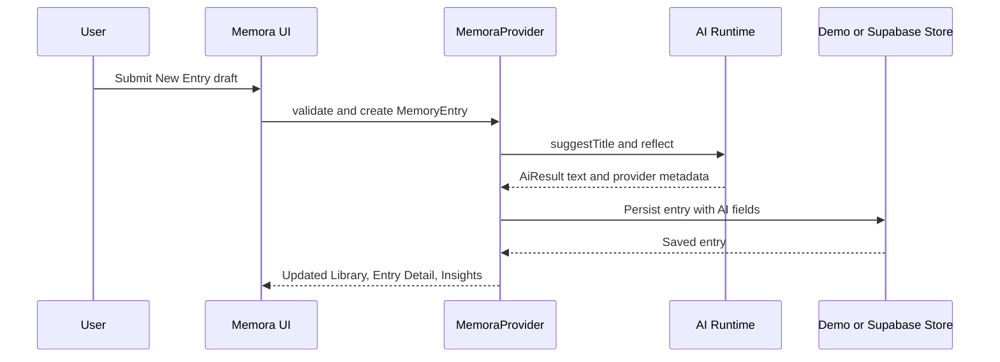
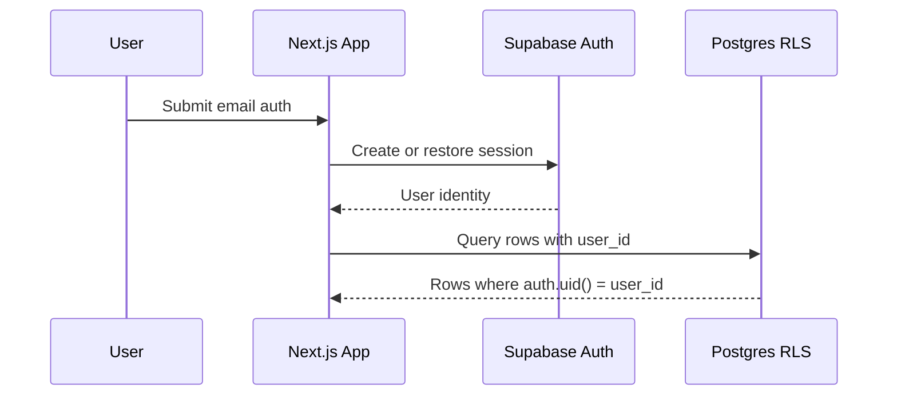
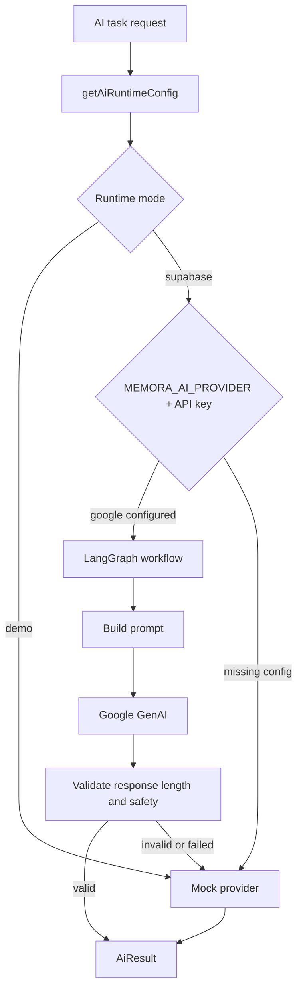
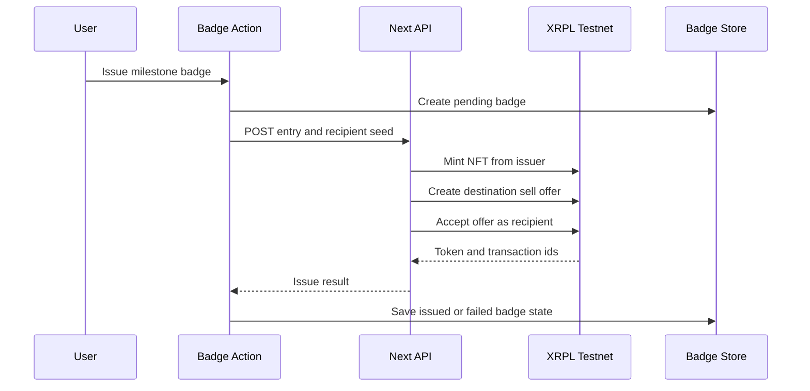

# System Architecture

Memora is implemented as a Next.js App Router application with a demo/local data path and Supabase-ready production boundaries. The product centers on private memory entries, shelf-based browsing, supportive AI reflection, insights, settings, and optional XRPL Testnet milestone badges.

## Runtime Topology

- `app/` contains App Router pages and API routes.
- `components/MemoraClient.tsx` owns client runtime state, demo persistence, Supabase session hydration, and feature actions.
- `lib/` contains domain types, validation, demo data, insights, AI workflow/runtime adapters, Supabase mappers, and XRPL helpers.
- `supabase/migrations/` defines the production tables and RLS policies for profiles, memory entries, and milestone badges.
- `tests/` covers domain behavior, runtime clients, Supabase mapping, integration behavior, and browser journeys.

## Data Flow

1. User signs in through demo mode or Supabase-backed auth.
2. User creates a memory entry with title, memory, lesson, emotion, tags, life phase, and tone.
3. The entry is persisted to the private store.
4. AI librarian mock behavior adds title and reflection.
5. Library, Insights, and Settings read only the current user's entries.

## Auth and RLS Flow

## AI Provider Flow

The AI Librarian uses a stable task interface for title suggestions, reflections, revisit prompts, and summaries. Demo mode always uses deterministic mock behavior for reliable demos and tests. Supabase mode can request the Google provider through environment variables, but the LangGraph workflow validates output and falls back to mock behavior when the model path is unavailable or unsafe.

## XRPL Badge Flow

Milestone badges are optional user-confirmed keepsakes for eligible Proud or Milestones entries. Private memory content never goes into public NFT metadata.

## Deployment and CI/CD

- Local demo mode requires no external credentials.
- Supabase mode requires `NEXT_PUBLIC_SUPABASE_URL`, `NEXT_PUBLIC_SUPABASE_ANON_KEY`, and `NEXT_PUBLIC_MEMORA_DEMO_MODE=false`.
- Live AI requires `MEMORA_AI_PROVIDER=google` and either `GEMINI_API_KEY` or `GOOGLE_API_KEY`.
- XRPL issuance requires a server-side `XRPL_TESTNET_ISSUER_SEED`.
- CI is expected to run typecheck, coverage, docs checks, build, and Playwright E2E before production deployment.

## Boundaries

- Demo mode uses local browser storage for hackathon reliability.
- Supabase helpers and migrations define the cloud path.
- AI behavior goes through a provider abstraction and defaults to deterministic mock behavior.
- XRPL is Testnet-only in the current implementation.
- AI output is supportive reflection only; it must not present therapy, diagnosis, clinical scoring, or emergency guidance as product capability.
