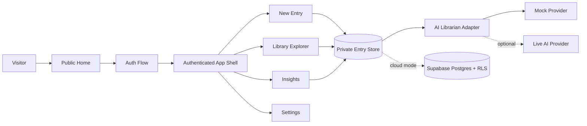
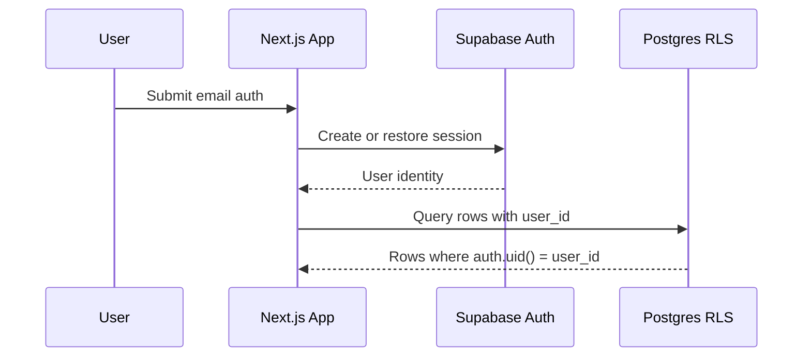

# System Architecture

Memora is implemented as a Next.js App Router application with a demo/local data path and Supabase-ready boundaries.

## Data Flow

1. User signs in through demo mode or Supabase-backed auth.
2. User creates a memory entry with title, memory, lesson, emotion, tags, life phase, and tone.
3. The entry is persisted to the private store.
4. AI librarian mock behavior adds title and reflection.
5. Library, Insights, and Settings read only the current user's entries.

## Auth and RLS Flow

## Boundaries

- Demo mode uses local browser storage for hackathon reliability.
- Supabase helpers and migrations define the cloud path.
- AI behavior goes through a provider abstraction and defaults to deterministic mock behavior.
