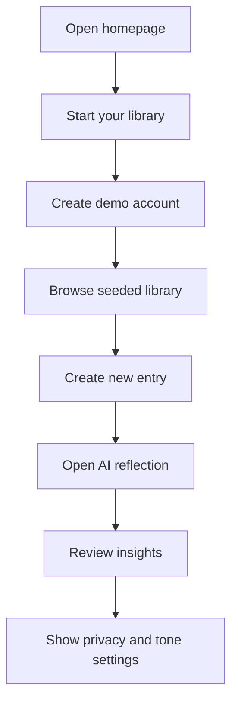

# Demo Runbook

Use this runbook to show the Memora Hackathon MVP without live AI or Supabase credentials.

## Steps

1. Run `npm run dev`.
2. Open the homepage.
3. Click `Start your library`.
4. Use the prefilled demo credentials.
5. Browse shelves in Library.
6. Create a new memory from New Entry.
7. Show the generated AI chapter title and reflection.
8. Visit Insights.
9. Visit Settings and show privacy/tone controls.

## Demo Guarantees

- Live AI is not required.
- Supabase credentials are not required for local demo mode.
- Seeded entries demonstrate Library, Insights, and AI Librarian behavior.
