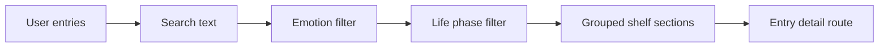

# Library Explorer

The Library is the primary product surface. It supports shelf browsing, search, filters, entry cards, and revisit navigation.

Key behaviors:

- Group by life phase.
- Filter by emotion and life phase.
- Search title, memory, lesson, and tags.
- Open entry detail.
- Show empty states with a clear add-entry action.

## Implementation

- `app/library/page.tsx` filters entries by query, emotion, and shelf.
- `lifePhases` from `lib/types.ts` drives shelf grouping so UI categories stay aligned with validation and storage.
- Search includes title, memory, lesson, and tags.
- Entry cards route to `/entry/[id]` for detail and delete actions.

## Tests

- `tests/e2e/memora.spec.ts` covers the homepage-to-auth-to-library journey, seeded library rendering, and new-entry revisit flow.
- `tests/unit/validation.test.ts` indirectly protects shelf and emotion value contracts used by filters.

Related OpenSpec change:

- `implement-library-explorer`
