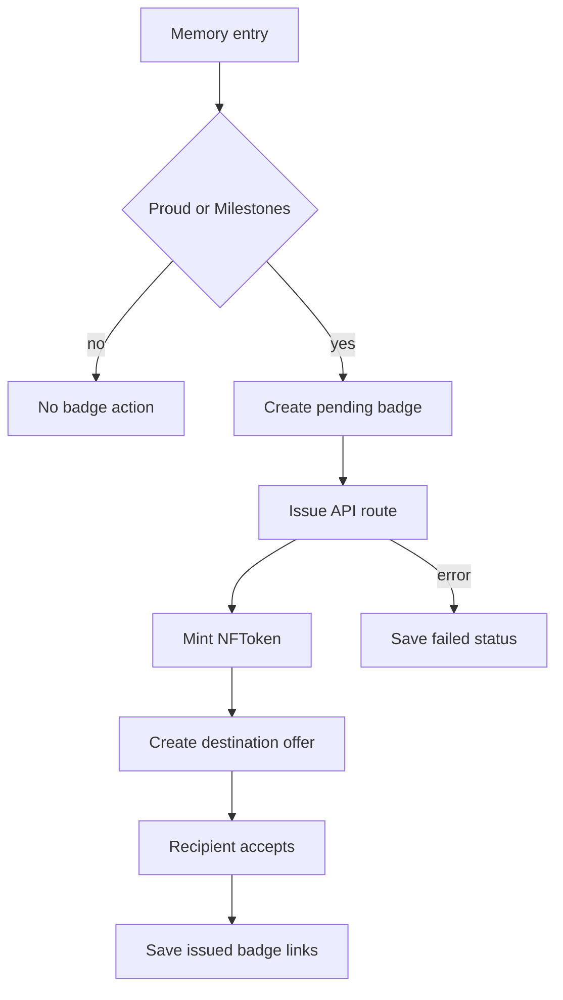

# XRPL Milestone Badges

XRPL milestone badges let a user explicitly commemorate a Proud or Milestones entry as a Testnet non-transferable NFT.

The badge is a keepsake, not a score or social feature. Public NFT metadata is intentionally minimal: badge name, category, event date, Memora issuer label, and version. Memory text, lessons, AI responses, email, user id, private tags, and emotional narrative stay inside Memora.

Runtime behavior:

- Demo mode stores the Testnet recipient wallet and badge records in browser localStorage.
- Supabase mode stores badge records in `xrpl_milestone_badges` with user-owned RLS.
- The issuer seed must stay server-side in `XRPL_TESTNET_ISSUER_SEED`.
- The app uses XRPL Testnet only. Mainnet and production wallet connectors are out of scope for this feature.

## Implementation

- `lib/xrpl-badges.ts` defines badge domain types, eligibility, minimal public metadata, Testnet constants, and public explorer links.
- `lib/xrpl-transactions.ts` builds NFToken mint, destination sell offer, and accept offer transactions.
- `components/MilestoneBadgeAction.tsx` owns user confirmation and visible badge state.
- `app/api/xrpl/badges/wallet/route.ts` creates demo recipient wallets.
- `app/api/xrpl/badges/issue/route.ts` performs server-side Testnet issuance with the issuer seed.
- `components/MemoraClient.tsx` stores pending, issued, or failed badge records.

## Public Metadata Boundary

Public metadata includes only badge name, category, event date, Memora issuer label, and metadata version. It excludes memory text, lessons, AI responses, email, user id, private tags, and emotional narrative.

## Tests

- `tests/unit/xrpl-badges.test.ts` covers eligibility, metadata, transaction builders, and explorer links.
- `tests/unit/supabase-mappers.test.ts` covers badge row/domain conversion.

Related OpenSpec change:

- `issue-xrpl-milestone-badges`
